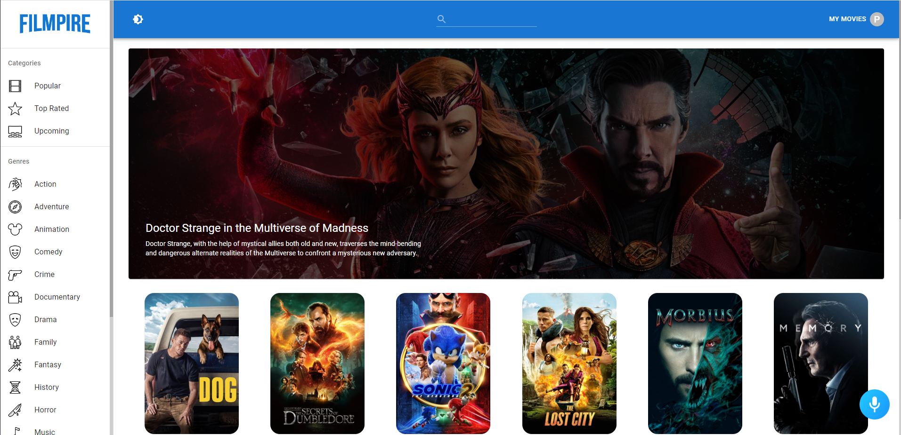
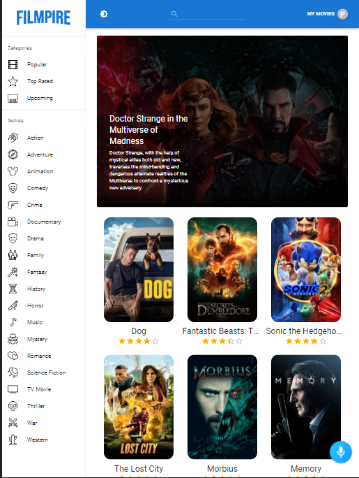
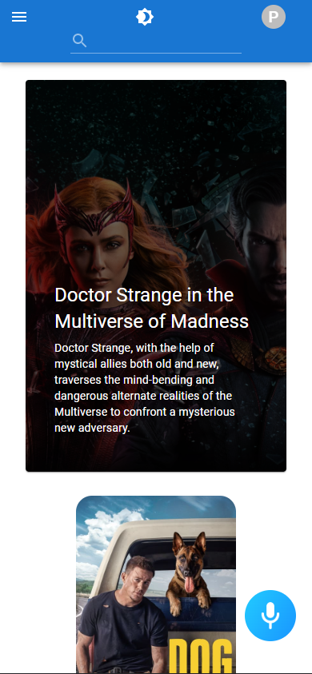

## Filmpire App by [@planetoida90210](http://github.com/planetoida90210)!

https://filmipire-planetoida.netlify.app/

## Hi! 

I present my latest application. Filmpire App is application for searching movies, add them to watchlist / favorites (after login to tmdb)
or just simply check some info about actors and films that they played. Filmpire had implemented Alan AI voice search with some easter eggs. 🥚

App is created in [REACT JS](https://reactjs.org/) styled with [MATERIALUI](https://mui.com/). There is additional feature of voice searching [ALANAI](https://alan.app/)

It works good on mutlitple devices | phone 📱 tablet | desktop 🖥️

Desktop:

Tablet:

Phone:

## Thanks !
